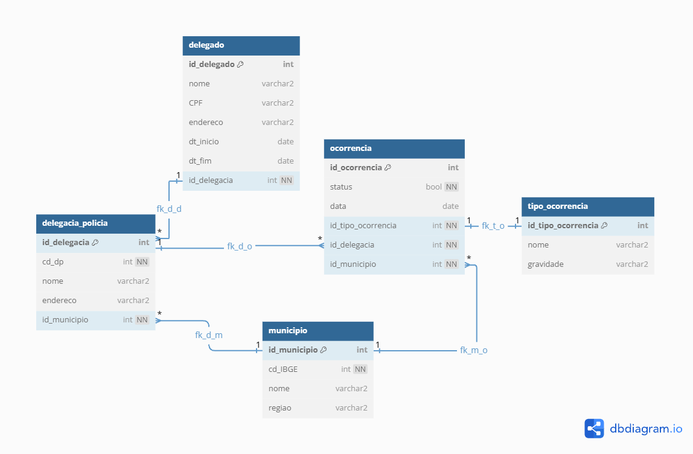

# Banco de dados relacional - SQL
Repositorio dedicado aos ensinamentos e exercícios praticados relacionados a matéria de bancos de dados relacionais.

---

###### MER-DelegaciaPolicia
**Atividade proposta pelo professor *Claudio Bonel***
Atividade realizada pela platarforma [BRModelo](https://app.brmodeloweb.com/).


---

###### DER - Delegacia de Polícia

**Atividade proposta pelo professor *Claudio Bonel***

Atividade realizada pela platarforma [dbdiagram.io](https://dbdiagram.io/).



Comandos utilizados para criação do DER, conforme [Docs dbdiagram](https://dbml.dbdiagram.io/docs)
```bash

// Use DBML to define your database structure
// Docs: https://dbml.dbdiagram.io/docs

Table delegacia_policia {
  id_delegacia int PK
  cd_dp int [not null]
  nome varchar2
  endereco varchar2
  id_municipio int [not null]
}

Table delegado {
  id_delegado int pk
  nome varchar2
  CPF varchar2
  endereco varchar2
  dt_inicio date
  dt_fim date
  id_delegacia int [not null]
}


Table municipio {
  id_municipio int pk
  cd_IBGE int [not null]
  nome varchar2
  regiao varchar2
}

Table ocorrencia {
  id_ocorrencia int pk
  status bool [not null]
  data date
  id_tipo_ocorrencia int [not null]
  id_delegacia int [not null]
  id_municipio int [not null]
}

Table tipo_ocorrencia {
  id_tipo_ocorrencia int pk
  nome varchar2
  gravidade varchar2
}

ref fk_d_d : delegado.id_delegacia < delegacia_policia.id_delegacia // one-to-many
ref fk_d_o: delegacia_policia.id_delegacia < ocorrencia.id_delegacia // one-to-many
ref fk_t_o : ocorrencia.id_tipo_ocorrencia - tipo_ocorrencia.id_tipo_ocorrencia // one-to-one
ref fk_m_o : ocorrencia.id_municipio > municipio.id_municipio // many-to-one
ref fk_d_m : delegacia_policia.id_municipio > municipio.id_municipio


```