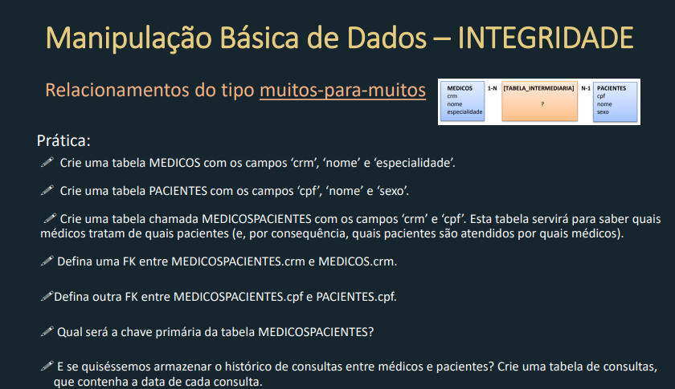

# Banco de dados relacional - SQL
Repositorio dedicado aos ensinamentos e exercícios praticados relacionados a matéria de bancos de dados relacionais.

---

###  História para os modelos:

*Você foi convidado/a para realizar o projeto de banco de dados, de um software de inteligência de negócios, para Segurança Pública
do Rio de Janeiro.
Ao iniciar a reunião com o usuário do Instituto de Segurança Pública, ele falou sobre suas necessidades relacionadas a esta primeira
entrega, onde é necessário ter os dados das Delegacias de Polícia, com o código da DP, o nome e endereço, bem como o responsável
pela Delegacia, para esta última informação, por se um dado sensível de uma pessoa, deve ser tratado dentro do projeto com a devida
atenção, portanto o cadastro das DPs NÃO deve contemplar nenhuma informação que os/as identifiquem, porém, esse cadastro de
responsáveis deve-se relacionar a DP com o nome do/a Delegado/a responsável.
Seguindo com sua explanação acerca das necessidades, alertou para importância de se obter dados dos nome dos municípios,
segundo o seu código do IBGE, bem como a região para qual o munício pertence.
Os dados das DPs e de região serão utilizados para mapearmos a quantidade de registros das ocorrências no estado do Rio de
Janeiro através dos Anos, Meses e do tipo da ocorrência*

--

###### MER-DelegaciaPolicia
**Atividade proposta pelo professor *Claudio Bonel***
Atividade realizada pela platarforma [BRModelo](https://app.brmodeloweb.com/).


---

###### DER - Delegacia de Polícia

**Atividade proposta pelo professor *Claudio Bonel***

Atividade realizada pela platarforma [dbdiagram.io](https://dbdiagram.io/).


Comandos utilizados para criação do DER, conforme [Docs dbdiagram](https://dbml.dbdiagram.io/docs)
```bash
Table delegacia_policia {
  id_delegacia int PK
  cd_dp int [not null]
  nome varchar2
  endereco varchar2
  id_municipio int [not null]
}

Table delegado {
  id_delegado int pk
  nome varchar2
  CPF varchar2
  endereco varchar2
  dt_inicio date
  dt_fim date
  id_delegacia int [not null]
}


Table municipio {
  id_municipio int pk
  cd_IBGE int [not null]
  nome varchar2
  regiao varchar2
}

Table ocorrencia {
  id_ocorrencia int pk
  status bool [not null]
  data date
  id_tipo_ocorrencia int [not null]
  id_delegacia int [not null]
  id_municipio int [not null]
}

Table tipo_ocorrencia {
  id_tipo_ocorrencia int pk
  nome varchar2
  gravidade varchar2
}

ref fk_d_d : delegado.id_delegacia < delegacia_policia.id_delegacia // one-to-many
ref fk_d_o: delegacia_policia.id_delegacia < ocorrencia.id_delegacia // one-to-many
ref fk_t_o : ocorrencia.id_tipo_ocorrencia - tipo_ocorrencia.id_tipo_ocorrencia // one-to-one
ref fk_m_o : ocorrencia.id_municipio > municipio.id_municipio // many-to-one
ref fk_d_m : delegacia_policia.id_municipio > municipio.id_municipio
```

---

###### DER - Delegacia de Polícia

**Atividade proposta pelo professor *Azriel Majdenbaum***

Atividade realizada pela platarforma [livesql.oracle](https://livesql.oracle.com/).
**Exercicio_criacao_tabela_oracle.png**



`comandos:`
```bash
CREATE TABLE medicos(
    crm NUMBER(6),
    nome VARCHAR2(100) NOT NULL,
    especialidade VARCHAR2(60) NOT NULL,
    CONSTRAINT pk_medico PRIMARY KEY (crm)
);

CREATE TABLE pacientes(
    cpf VARCHAR2(11),
    nome VARCHAR2(100) NOT NULL,
    sexo CHAR(1) NOT NULL,
    CONSTRAINT pk_paciente PRIMARY KEY (cpf)
);

CREATE TABLE medicos_pacientes(
    crm_medico NUMBER(6),
    cpf_paciente VARCHAR2(11),
    CONSTRAINT pk_medico_paciente PRIMARY KEY (crm_medico, cpf_paciente),
    CONSTRAINT fk_tb_medico FOREIGN KEY (crm_medico) 
        REFERENCES medicos(crm),
    CONSTRAINT fk_tb_paciente FOREIGN KEY (cpf_paciente) 
        REFERENCES pacientes(cpf)
);

CREATE TABLE historico_consultas(
    id_consulta NUMBER GENERATED BY DEFAULT AS IDENTITY,
    crm_medico NUMBER(6),
    cpf_paciente VARCHAR2(11),
    data_consulta DATE,
    CONSTRAINT pk_consulta PRIMARY KEY (id_consulta),
    CONSTRAINT fk_consulta_medico FOREIGN KEY (crm_medico)
        REFERENCES medicos(crm),
    CONSTRAINT fk_consulta_paciente FOREIGN KEY (cpf_paciente)
        REFERENCES pacientes(cpf)
);
```

